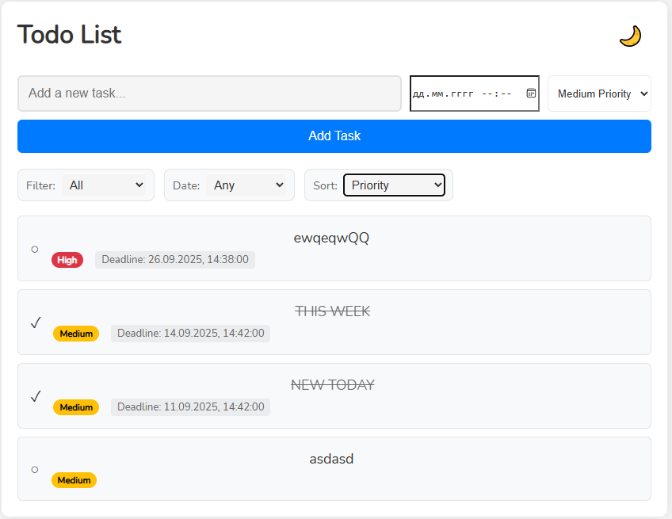
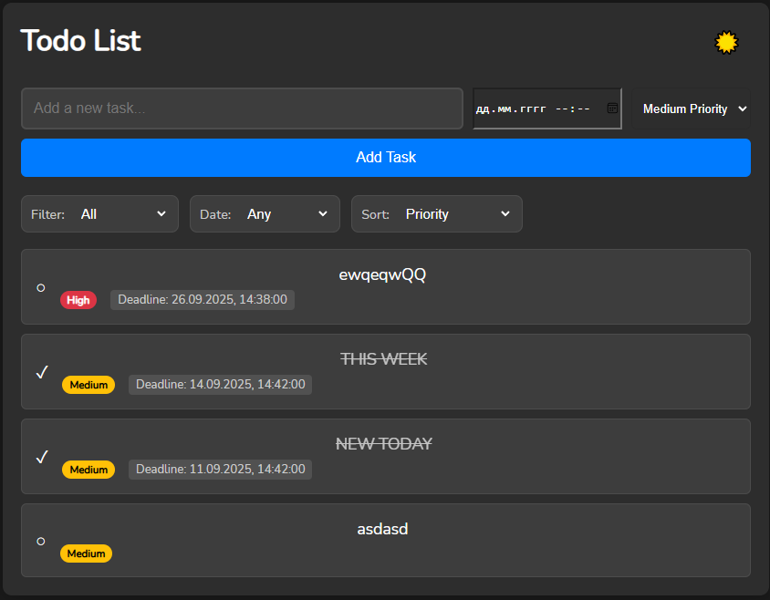
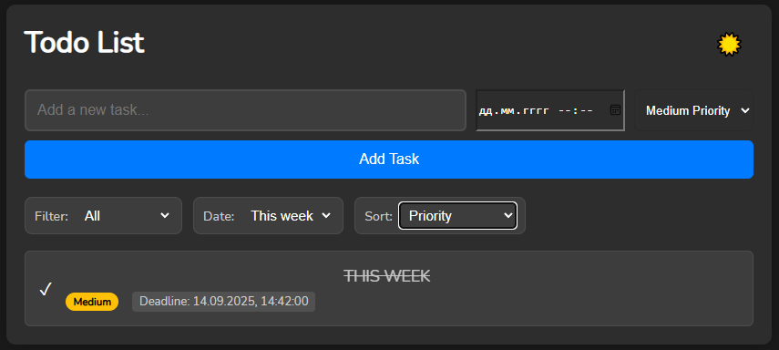
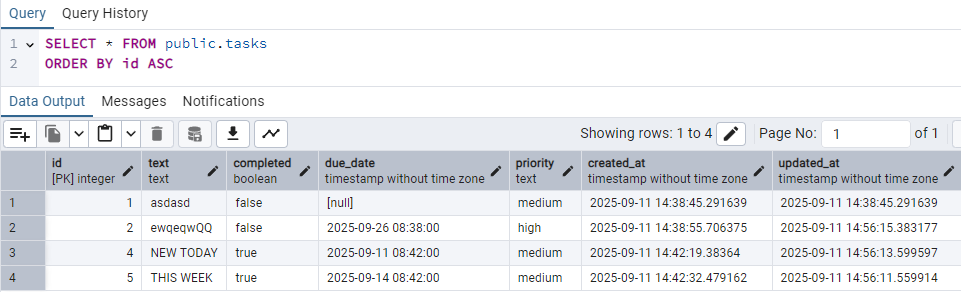
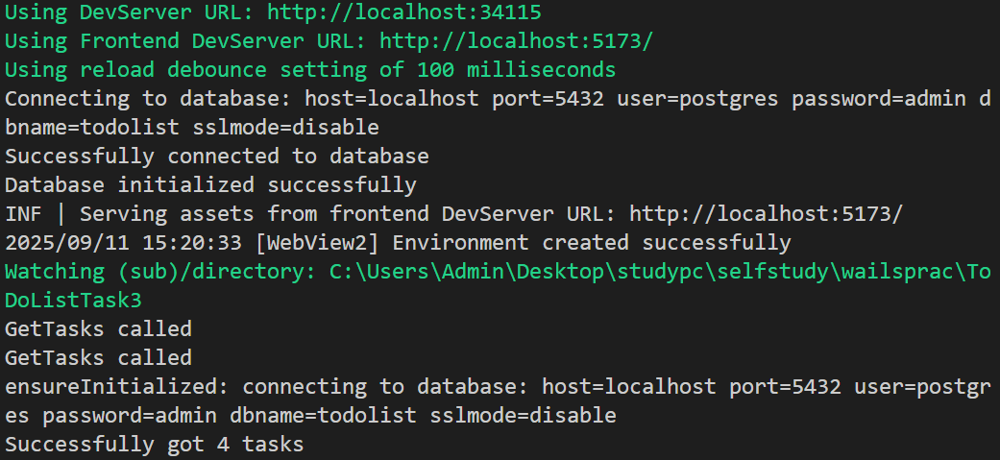

# Todo List Desktop Application

Modern desktop todo list application built with Wails, React, and PostgreSQL. Features a beautiful dark/light theme and responsive design.

## Demo

Watch the application in action:


## Screenshots

### Light and Dark Themes

| Light Mode                                  | Dark Mode                                 |
| ------------------------------------------- | ----------------------------------------- |
|  |  |

### Task Filtering



### Database View



### Console Output



## Features

- ✨ Modern, responsive user interface
- 🌓 Dark and light theme support
- 📝 Create, edit, and delete tasks
- 🏷️ Priority levels (Low, Medium, High)
- 📅 Due date management
- 🔍 Filter tasks by status and priority
- 📊 Sort tasks by different criteria
- 💾 PostgreSQL database for reliable data storage

## Technologies

- [Wails](https://wails.io/) - Go framework for desktop applications
- [React](https://reactjs.org/) - Frontend UI library
- [PostgreSQL](https://www.postgresql.org/) - Database
- Modern CSS with variables for theming

## Prerequisites

Before you begin, ensure you have the following installed:

- Go 1.21 or later
- Node.js 16 or later
- PostgreSQL
- Wails CLI

## Getting Started

### Installation

1. Clone the repository:

```bash
git clone <repository-url>
cd myproject
```

2. Install frontend dependencies:

```bash
cd frontend
npm install
cd ..
```

3. Set up the PostgreSQL database:

```sql
CREATE DATABASE todolist;
```

4. Configure the database connection:
   - Copy `config.example.json` to `config.json`
   - Update the database settings in `config.json` with your PostgreSQL credentials

### Development

- Run the application in development mode:

```bash
wails dev
```

## Project Structure

```
myproject/
├── app.go              # Main application logic
├── main.go            # Entry point
├── frontend/          # React frontend
│   ├── src/
│   │   ├── App.jsx   # Main React component
│   │   └── App.css   # Styles with theme support
├── internal/          # Backend Go code
│   ├── domain/       # Business logic
│   ├── repository/   # Database interactions
│   └── service/      # Business services
└── build/            # Build configurations
```

## Features in Detail

### Task Management

- Create new tasks with title, priority, and due date
- Mark tasks as complete/incomplete
- Delete tasks with confirmation
- Edit existing tasks

### User Interface

- Responsive design that works on all screen sizes
- Smooth animations and transitions
- Intuitive controls and layout
- Dark/light theme toggle with CSS variables

### Data Persistence

- All tasks are stored in PostgreSQL
- Reliable data storage and retrieval
- Efficient database queries

## License

This project is licensed under the MIT License - see the LICENSE file for details.
